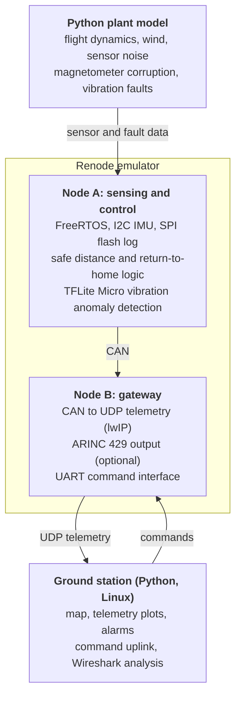

# VoltDragon

Avionics software for a **power-line inspection UAV** that runs **entirely in
simulation**, with no physical boards.

Two virtual **STM32F4 (Cortex-M4)** nodes run in the [Renode](https://renode.io)
emulator. A Python **plant model** simulates flight dynamics, sensor noise and
faults, and a Python **ground station** on Linux shows telemetry and sends commands.
The same firmware is meant to be ported to a real Nucleo board later.

**Topics covered:** embedded C · ARM Cortex-M · I2C / SPI / UART / CAN / Ethernet ·
FreeRTOS · DO-178C-style process · MISRA C · MC/DC · Edge AI (TFLite Micro) · ARINC 429

## Architecture



## Repository layout

| Path | Contents |
|------|----------|
| `firmware/node_a` | Sensing and flight-control node |
| `firmware/node_b` | Gateway node |
| `firmware/common` | Code shared by both nodes |
| `cmake/` | Cross-compilation toolchain file |
| `renode/` | Renode platform and start-up scripts |
| `sim/plant` | Python plant model |
| `ground_station/` | Python ground station |
| `tests/robot` | Robot Framework system tests (Renode) |
| `tests/python` | pytest unit tests |
| `tools/gdb` | GDB helpers (fault-frame decoding) |
| `docs/` | [Roadmap](docs/roadmap.md), [HLR](docs/requirements/HLR.md), [LLR](docs/requirements/LLR.md), [debugging](docs/debugging.md), [MISRA deviations](docs/misra-deviations.md) |

## Building

Prerequisites: `arm-none-eabi-gcc`, CMake 3.20 or newer, Ninja, Python 3.11 or newer
and Renode 1.17. Development is done on Linux (WSL on Windows).

```sh
# Firmware
cmake --preset debug
cmake --build --preset debug

# Run Node A in Renode (see docs/debugging.md for the debug keys and GDB)
renode renode/node_a.resc

# Renode system tests (needs: pip install -r /opt/renode/tests/requirements.txt)
renode-test -r build/robot tests/robot/*.robot

# Python plant model and ground station
python -m venv .venv
source .venv/bin/activate        # Windows: .venv\Scripts\activate
pip install -e ".[dev]"
pytest
```

## Status

Phase 1 complete: bare-metal Node A with its own startup code, linker script,
register-level UART, watchdog, fault handler and a reset record that survives resets.

Phase 2 in progress: Node A reads an LSM9DS1 IMU over a register-level I2C driver
at 100 Hz. See the [roadmap](docs/roadmap.md).

## Limitations: to be verified in the hardware phase

Renode is **not cycle-accurate**, and some peripherals are simplified (for example,
the RCC reset flags are not modelled; see [debugging.md](docs/debugging.md)). Renode's
LSM9DS1 model scales its outputs by ideal counts per unit rather than the datasheet
sensitivities, so the firmware reads the gyroscope 5 % and the magnetometer 14.7 % high
in simulation (see [node_a_imu.robot](tests/robot/node_a_imu.robot)). Timing figures such as interrupt latency and
inference time do not reflect real hardware. Electrical concerns (I2C pull-ups, CAN
termination, signal integrity) are not simulated. These items must be verified once
the firmware runs on a real board.
