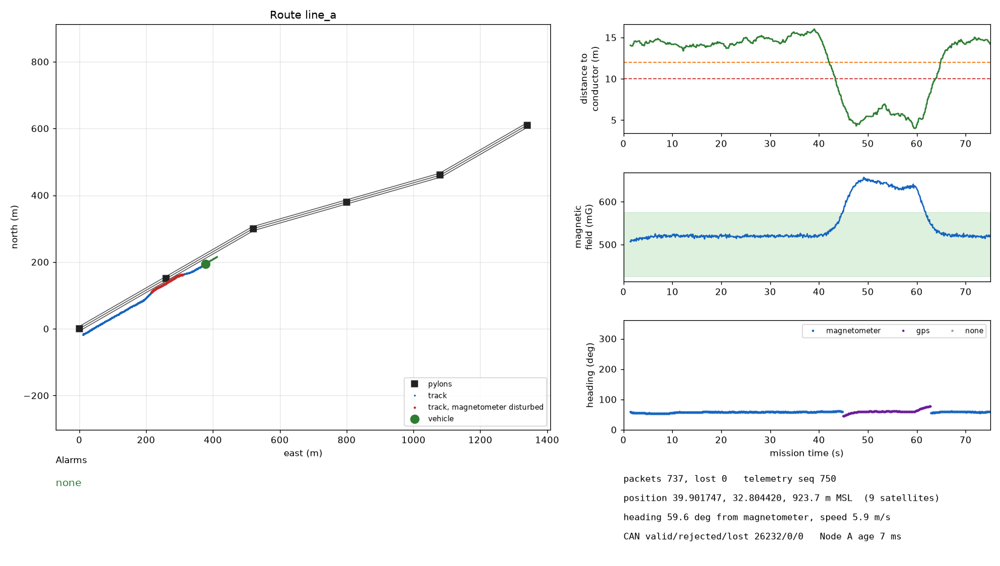
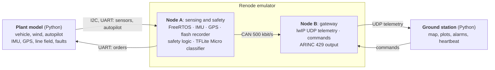

# VoltDragon

[](https://github.com/1akin1/VoltDragon/actions/workflows/ci.yml)

Avionics software for a **power-line inspection UAV**, built and verified
**entirely in simulation**.

Two **STM32F407 (Cortex-M4F)** nodes run their real firmware in the
[Renode](https://renode.io) emulator. A Python **plant model** flies the vehicle
along a high-voltage line, with wind, sensor noise, magnetic interference from the
line and rotor faults, and closes the loop with the firmware. A Python **ground
station** shows the flight and sends commands. The work follows a
**DO-178C-style process**: requirements traced to code and tests, MISRA C, and
MC/DC coverage of the safety logic, all checked in CI.

**Topics:** embedded C · ARM Cortex-M · startup code and linker scripts · I2C / SPI /
UART / CAN / Ethernet drivers · FreeRTOS · lwIP · ARINC 429 · Edge AI (TensorFlow Lite
Micro, INT8) · Renode · Robot Framework · DO-178C-style traceability · MISRA C:2012 · MC/DC



## What it does

| Area | Implemented | Evidence |
|------|-------------|----------|
| Bare metal | Own startup code and linker script, register-level drivers for every peripheral, watchdog, HardFault capture, a reset record that survives resets | [debugging](docs/debugging.md), `node_a_boot.robot` |
| Sensors | LSM9DS1 IMU over I2C at 100 Hz, NMEA GPS, a flight data recorder on SPI flash that never blocks the control loop | `node_a_imu.robot`, `node_a_flashlog.robot` |
| Networks | CAN between the nodes (sequence counter and CRC on every frame), UDP telemetry and commands with lwIP on Node B's own Ethernet driver, ARINC 429 output | [CAN](docs/can-messages.md), [telemetry](docs/telemetry.md), [ARINC 429](docs/arinc429.md) |
| Real time | FreeRTOS, rate-monotonic tasks, static allocation, a watchdog fed only while every task runs; a priority inversion reproduced and fixed | [RTOS](docs/rtos.md) |
| Safety | Keeps 10 m from the line, returns home on link loss or low battery, lands on critical battery; operator modes through one transition table | [safety logic](docs/autopilot-link.md), [MC/DC report](docs/mcdc-report.md) |
| Fault detection | Detects magnetometer corruption near the line and falls back to the GPS course; an INT8 neural network detects propeller and bearing faults on the MCU | [simulation](docs/simulation.md), [Edge AI](docs/edge-ai.md) |
| Process | 20 high-level and 97 low-level requirements traced to code and tests; MISRA C:2012 with documented deviations; 100 % MC/DC of the safety logic | [traceability](docs/traceability.md), [MISRA](docs/misra-report.md), [MC/DC](docs/mcdc-report.md) |

## Results

Measured in the co-simulation and checked by the tests on every commit:

| Requirement | Result |
|-------------|--------|
| Never closer than 10 m to the line (HLR-001) | The close pass, planned at 4 m from a conductor, stays more than 10 m away |
| Proximity warning within 100 ms (HLR-002) | In the same 20 ms control cycle as the GPS fix |
| Return to home after 3 s without the ground link (HLR-003) | Link declared lost 3.0-3.3 s after the last heartbeat, return to home within 50 ms of that |
| Vibration fault reported within 2 s (HLR-009) | About 1 s from fault onset to the ground station |
| Priority inversion (Phase 4 demonstration) | Worst-case wait 85 ms with a semaphore, 5 ms with priority inheritance |
| Vibration classifier | INT8 model matches FP32 (99.98 % of test windows), no false alarm in 3 h of fault-free flight |

| Verification | Count |
|--------------|------:|
| Host unit test programs (ctest) | 12 |
| Python tests (pytest) | 150 |
| Renode system tests (Robot Framework) | 76 |
| Closed-loop co-simulated flights | 21 tests over 6 scenarios |
| Test cases traced to a requirement | 217 |
| Open MISRA C:2012 findings | 0 |
| MC/DC of the safety logic (`safety.c`) | 24 / 24 conditions |

## Architecture


```mermaid
flowchart LR
    plant["<b>Plant model</b> (Python)<br/>vehicle, wind, autopilot<br/>IMU, GPS, line field, faults"]
    subgraph renode["Renode emulator"]
        direction TB
        a["<b>Node A</b>: sensing and safety<br/>FreeRTOS · IMU · GPS · flash recorder<br/>safety logic · TFLite Micro classifier"]
        b["<b>Node B</b>: gateway<br/>lwIP UDP telemetry · commands<br/>ARINC 429 output"]
        a -- "CAN 500 kbit/s" --> b
    end
    gs["<b>Ground station</b> (Python)<br/>map, plots, alarms, heartbeat"]
    plant -- "I2C, UART: sensors, autopilot" --> a
    a -- "UART: orders" --> plant
    b -- "UDP telemetry" --> gs
    gs -- "commands" --> b
```

Buses, pins, tasks and an end-to-end safety event: [architecture](docs/architecture.md).

## Quick start

Linux (or WSL on Windows) with `arm-none-eabi-gcc`, CMake 3.20+, Ninja, Python 3.11+
and Renode 1.17.

```sh
git clone --recurse-submodules https://github.com/1akin1/VoltDragon.git
cd VoltDragon
python -m venv .venv && source .venv/bin/activate
pip install -e ".[dev]"

# Build both nodes' firmware
cmake --preset debug
cmake --build --preset debug

# Run both nodes on a shared CAN bus (debug keys and GDB: docs/debugging.md)
renode renode/system.resc

# Fly the inspection mission: the plant model drives both nodes (docs/simulation.md)
python -m sim.mission --duration 90 --record build/mission.tlm
python -m ground_station.display --replay build/mission.tlm
# Other scenarios: no-avoidance, link-loss, battery, prop-damage, bearing-wear
python -m sim.mission --scenario link-loss --duration 25
```

To watch a flight live, Node B's Ethernet can be bridged to the host instead
(`sudo python -m sim.mission --tap`, then `python -m ground_station.display`; see
[telemetry](docs/telemetry.md)).

### Tests and checks

```sh
# Host unit tests (native gcc)
cmake --preset host-tests && cmake --build --preset host-tests && ctest --preset host-tests

# Renode system tests (needs: pip install -r /opt/renode/tests/requirements.txt)
renode-test -r build/robot tests/robot/*.robot

# Closed-loop flights, checked against the plant's ground truth (about 20 minutes)
python -m pytest tests/integration

# Python tests and lint
pytest && ruff check .

# Process checks (each fails if its report is out of date)
python tools/trace/trace.py --check      # traceability matrix
python3 tools/misra/misra.py --check     # MISRA C:2012, cppcheck 2.10, after cmake --preset debug
python3 tools/coverage/mcdc.py --check   # MC/DC, clang 19
```

Retraining the vibration classifier (optional; the trained model is committed):
`pip install -e ".[ml]"`, then `python -m ml.dataset --out build/ml/dataset.npz` and
`python -m ml.train --dataset build/ml/dataset.npz` ([Edge AI](docs/edge-ai.md)).

## Documentation

| Topic | Pages |
|-------|-------|
| Overview | [architecture](docs/architecture.md), [roadmap](docs/roadmap.md), [demo video plan](docs/demo.md) |
| Requirements and process | [HLR](docs/requirements/HLR.md), [LLR](docs/requirements/LLR.md), [traceability matrix](docs/traceability.md), [MISRA compliance plan](docs/misra-deviations.md), [MISRA report](docs/misra-report.md), [MC/DC report](docs/mcdc-report.md) |
| Node A | [RTOS](docs/rtos.md), [autopilot link and safety logic](docs/autopilot-link.md), [Edge AI](docs/edge-ai.md), [vibration model report](docs/vibration-model-report.md) |
| Node B and buses | [CAN messages](docs/can-messages.md), [telemetry](docs/telemetry.md), [command interface](docs/command-interface.md), [ARINC 429](docs/arinc429.md) |
| Simulation and debugging | [simulation](docs/simulation.md), [debugging](docs/debugging.md), [Robot tests](tests/robot/README.md) |

## Repository layout

| Path | Contents |
|------|----------|
| `firmware/node_a` | Sensing and safety node (FreeRTOS) |
| `firmware/node_b` | Gateway node (bare metal) |
| `firmware/common` | Startup code, drivers and protocols shared by both nodes |
| `cmake/` | Cross-compilation toolchain file |
| `renode/` | Renode platforms and scripts; the ARINC 429 transmitter model |
| `sim/` | Plant model (`sim/plant`), co-simulation and the mission runner |
| `ground_station/` | Display, telemetry decoder, command tool |
| `ml/` | Vibration dataset, features, training and INT8 quantisation; trained models |
| `tests/unit` | Host unit tests (ctest), including the MC/DC test set for the safety logic |
| `tests/robot` | Robot Framework system tests in Renode |
| `tests/integration` | Closed-loop flights: plant model and both nodes |
| `tests/python` | pytest: plant model, ground station, ML pipeline |
| `tools/` | Traceability (`trace`), MISRA (`misra`), MC/DC (`coverage`), demo clips (`demo`), GDB helpers, TFLM vendoring |
| `third_party/` | lwIP 2.2.1 and FreeRTOS (submodules), the TensorFlow Lite Micro subset Node A uses |

## Limitations: to be verified on hardware

Renode is **not cycle-accurate**, and some peripherals are simplified (for example,
the RCC reset flags are not modelled; see [debugging](docs/debugging.md)). Renode's
LSM9DS1 model scales its outputs by ideal counts per unit rather than the datasheet
sensitivities, so the firmware reads the gyroscope 5 % and the magnetometer 14.7 % high
in simulation (see [node_a_imu.robot](tests/robot/node_a_imu.robot)); the co-simulation
compensates for this, and for other model differences listed in
[simulation](docs/simulation.md). The magnetometer and accelerometer axes are assumed
aligned; a real LSM9DS1 needs its magnetometer axes remapped. Timing figures such as
interrupt latency and inference time do not reflect real hardware.

The vibration classifier is trained on simulated vibration, and at Node A's 100 Hz
IMU rate the rotor tones (about 80 Hz) alias; real hardware would read the LSM9DS1
FIFO at 952 Hz and need data from real airframes
([Edge AI: limitations](docs/edge-ai.md#limitations)). The ARINC 429 transmitter is
a model with its own command set, not a real chip's ([ARINC 429](docs/arinc429.md)).
Electrical concerns (I2C pull-ups, CAN termination, signal integrity) are not
simulated. The STM32F4 Ethernet MAC needs an AHB clock of at least 25 MHz, but both
nodes run from the 16 MHz HSI; Node B needs the PLL enabled (and the clock-dependent
settings updated) before its Ethernet can work on silicon.

## Status

All seven phases of the [roadmap](docs/roadmap.md) are complete; the demo video is
being recorded from the [plan](docs/demo.md). Next steps beyond the roadmap:
insulator and hot-spot detection from a simulated camera, automatic fault reports
with GPS positions, and porting the firmware to a real Nucleo board.
