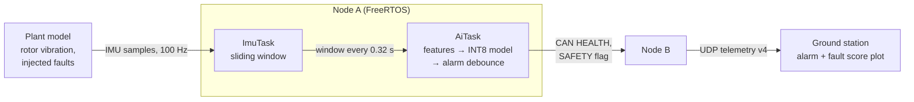

# Edge AI: on-board vibration fault detection

Phase 5. Node A classifies the vibration its IMU picks up with an INT8 neural
network on TensorFlow Lite Micro and raises a `VIBRATION_FAULT` alarm that
reaches the ground station within 2 s of the fault (HLR-009). Everything
runs in simulation: the plant model shakes the IMU, Renode runs the firmware.



| | |
|---|---|
| Faults | Damaged propeller (imbalance), worn motor bearing |
| Input | 64 IMU samples (0.64 s) of accelerometer and gyroscope, every 0.32 s |
| Features | 42: log band power in 7 frequency bands × 6 axes |
| Model | Dense 42 → 32 → 16 → 3, 1955 parameters, full-integer INT8, 5.8 KB |
| Test accuracy | FP32 99.98 %, INT8 99.98 % (windows); all 36 test faults detected |
| Detection time | 0.93 s median, 1.21 s worst on the test flights; 1.0 s in the co-simulated flights |
| False alarms | None in 3 h of fault-free flights |
| On Node A | 1252 bytes of tensor arena, 2.9 ms per window in Renode (not cycle-accurate) |

## The fault model

The plant model ([sim/plant/vibration.py](../sim/plant/vibration.py)) gives each
of the four rotors a speed that follows the thrust it delivers (speed grows
with the square root of thrust, about 80 Hz in a hover) and a small residual
imbalance, so a healthy airframe already vibrates a little (about 0.015 g). An
imbalance force grows with the square of the rotor speed and rotates in the
rotor plane; it also rocks the airframe, which the gyroscope sees.

| Fault | Physical cause | Signature |
|-------|----------------|-----------|
| `imbalance` | Chipped or bent propeller | Strong tone at the rotor frequency on the radial axes (0.25 g at severity 1), roll/pitch wobble on the gyroscope, weaker twice-per-revolution axial component |
| `bearing` | Worn motor bearing | Impacts once per revolution: broadband, impulsive vibration, strongest along the motor axis (z, 0.12 g RMS at severity 1), plus a tone at the ball-pass frequency |

A fault appears suddenly at its onset time, on one rotor, with a severity that
scales its vibration. The `prop-damage` and `bearing-wear` mission scenarios
inject one at 15 s ([simulation.md](simulation.md)).

**Aliasing.** Node A samples the IMU at 100 Hz, so the rotor tones (around
80 Hz) arrive aliased below the 50 Hz Nyquist frequency: an 80 Hz rotor shows
up at 20 Hz. The plant evaluates the vibration at the sample instants, so the
aliasing is modelled exactly and the classifier learns the aliased signature.
A real implementation would read the LSM9DS1's FIFO at its 952 Hz output rate
instead; see [Limitations](#limitations).

## Data

[`ml/dataset.py`](../ml/dataset.py) flies 400 plant-only flights of 60 s
(24000 s of data, in about 4 minutes on 12 cores; Renode is not needed for
this). Each flight draws its own conditions:

- flight plan: hover (15 %) or cruise at 3 to 9 m/s, altitude 15 to 35 m,
  offset 14 to 30 m from the line, start anywhere along the first 300 m;
- wind: mean up to 6 m/s per axis, gusts with a standard deviation of 0.3 to 3 m/s;
- the healthy airframe's vibration level: 0.6 to 1.6 times nominal;
- no fault, an imbalance or a bearing fault (a third each), on a random rotor,
  with onset between 5 s and 50 s and severity 0.3 to 1.2.

Samples are converted to what Node A's driver reports: the sensor's LSB
quantisation, then whole mg and mdps, clipped at the configured full-scale
ranges. The features are therefore computed from the same numbers on the PC
and on the MCU.

## Features

For each window of 64 samples and each of the six axes
([ml/features.py](../ml/features.py), [vib_features.c](../firmware/node_a/src/vib_features.c)):

1. remove the window's mean (gravity and slow manoeuvres);
2. apply a periodic Hann window;
3. compute the power of DFT bins 1 to 32 (1.5625 Hz each);
4. sum the power in 7 bands (bins 1-2, 3-5, 6-9, 10-14, 15-20, 21-26, 27-32)
   and take log10(power + 1e-6).

Frequency bands suit the problem: an imbalance is a narrow tone on the radial
axes, a bearing fault is broadband energy along z, and manoeuvres stay in the
lowest band. The log keeps a dynamic range of several decades in one int8
input scale. On the MCU the DFT is computed directly with a 64-entry cosine
table (32 bins × 64 samples × 6 axes); there is no FFT library to verify.

## Model and quantisation

[`ml/train.py`](../ml/train.py) trains a small dense network with Keras:

- windows are labelled with the class of at least 3/4 of their samples
  (windows straddling an onset are left out of training);
- training, validation and test sets are split **by flight** (70/15/15 %), so
  no flight contributes to two sets;
- the features are standardised for training, and the standardisation is then
  folded into the first layer's weights, so the deployed model takes the raw
  features and Node A does no extra arithmetic;
- the model is converted twice: FP32, and full-integer INT8 (int8 input and
  output, calibrated on 1000 training windows);
- both are evaluated with the TFLite interpreter's **reference kernels**, the
  same arithmetic TensorFlow Lite Micro runs on Node A.

The full report, generated by the script, is
[vibration-model-report.md](vibration-model-report.md). In short: INT8 and
FP32 reach the same test accuracy (99.98 %) and agree on every test window;
the largest difference in a class probability is 0.11. INT8 halves the
flatbuffer (9928 → 5808 bytes) and needs no floating point inside the network.

### What the soak test caught

The first model looked perfect on its test set (17 minutes of fault-free
flight, no false alarms), but a separate soak run of 90 fault-free flights of
120 s gave **4 false alarms in 3 hours**, all "imbalance" on airframes with a
healthy vibration level near the top of its range. The cause was in the data:
the dataset then included faults down to severity 0.2 (0.05 g), which a rough
but healthy airframe reaches when its four rotors happen to vibrate in phase.
Short 40 s training flights rarely showed those slow beats.

The fix was a requirement decision plus more representative data: the
smallest fault to detect is severity 0.3 (0.075 g at hover, three times the
roughest healthy rotor's residual), and the flights became longer and more
numerous (400 × 60 s instead of 240 × 40 s). The reported soak test now uses a
fresh seed, because the first soak set had served to find the problem; it
shows no false alarm and no window classified as a fault in 3 hours.

## On Node A

| Item | Where |
|------|-------|
| Sliding window, features | [vib_features.c](../firmware/node_a/src/vib_features.c) |
| Interpreter wrapper (C interface to C++) | [vib_model.cc](../firmware/node_a/src/vib_model.cc) |
| The model as a C array (generated) | [vib_model_data.c](../firmware/node_a/src/vib_model_data.c) |
| Alarm debouncing | [vib_alarm.c](../firmware/node_a/src/vib_alarm.c) |
| Task glue, alarm logging and recording | [health.c](../firmware/node_a/src/health.c) |
| TFLM log output to the debug console | [tflm_port.cc](../firmware/node_a/src/tflm_port.cc) |

**Tasks.** ImuTask adds every valid sample to the window; every 32 samples it
copies the window (under a lock) and wakes AiTask with a task notification. A
failed IMU read restarts the window, so a window never spans a gap. AiTask has
the longest period (320 ms) and so, rate-monotonically, the lowest priority of
the periodic work after LogTask ([rtos.md](rtos.md)).

**Static memory only.** The interpreter and the op resolver are C++ objects,
but our start-up code runs no static constructors (the linker script rejects
them), so they are built with placement new into static storage at start-up.
The tensor arena is a 2 KB static array; the model uses 1252 bytes of it. The
interpreter is built with `TF_LITE_STATIC_MEMORY`, so it never allocates.

**C++ without its run-time.** Only the TFLM library and the thin wrapper are
C++, compiled with `-fno-exceptions -fno-rtti -fno-threadsafe-statics`; the
rest of the firmware stays C.

**Vendored subset of TFLM.** [`third_party/tflite-micro`](../third_party/tflite-micro/README.md)
holds only the 28 sources Node A links (the interpreter, memory planners and
the reference FULLY_CONNECTED and SOFTMAX kernels) and the headers they
include, with the licences: 116 files instead of the 43 MB TFLM checkout plus
a patched flatbuffers download. [`tools/tflm/vendor.sh`](../tools/tflm/vendor.sh)
regenerates it from a pinned TFLM commit; the source list was found by linking
the wrapper against the whole TFLM tree and keeping the objects the linker
pulled in. Node A now uses 97.5 KB of its 1 MB of flash (Debug build; 88.9 KB
in Release) and 24 KB of RAM.

**Alarm.** A fault is raised when 3 of the last 4 windows are classified as a
fault, with the most frequent fault class; it clears after 8 nominal windows
in a row (2.56 s). One misclassified window therefore never raises or clears
the alarm, and a fault that every window shows raises it 0.64 s after the
first window that shows it.

**Advisory, not flight-critical.** The alarm is for the operator: Node A takes
no flight action on it. AiTask is not part of the watchdog supervision; a
monitor that stops classifying (the model failed to load, or AiTask is
starved) is reported as inactive in telemetry and raises a warning at the
ground station, rather than resetting the flight-control node.

## To the ground station

- Node A sets the vibration flag (0x40) in its CAN SAFETY message and sends a
  HEALTH message (0x108) at 50 Hz: alarm, the latest window's class and
  probability, a fault score (100 minus the latest window's probability of
  nominal), an active flag and a window counter ([can-messages.md](can-messages.md)).
- Node B logs each alarm change as the HEALTH message arrives and puts the
  alarm and the fault score into telemetry version 4 ([telemetry.md](telemetry.md)).
- The ground station raises a critical `VIBRATION FAULT` alarm naming the
  fault (damaged propeller or worn motor bearing), warns if the monitor is
  inactive, and plots the fault score.
- Each alarm change is also stored in the flight-data recorder (HLR-018).

## Verification

| Level | What | Where |
|-------|------|-------|
| Python unit | Vibration model, dataset, features and alarm logic | `tests/python/test_plant.py`, `test_ml_dataset.py`, `test_ml_features.py` |
| Host unit (C) | C features against the Python reference (generated vectors); window timing; alarm debouncing | `tests/unit/test_vib_features.c` |
| Host unit (C++) | TFLM built natively runs the INT8 model: quantised input within one step, outputs **bit-exact** against the Python reference interpreter, raw samples classified correctly | `tests/unit/test_vib_model.cc` |
| Renode (Node A) | Model loads; healthy IMU classified nominal; a damaged propeller's signature (fed into the sensor model) raises the alarm within 2 s and clears it afterwards; alarm records in the flight recorder | `tests/robot/node_a_ai.robot` |
| Renode (system) | The alarm byte in the UDP packet on the wire | `tests/robot/system_telemetry.robot` |
| Co-simulation | The plant's damaged propeller and worn bearing at 15 s: alarm on Node A at 15.996 s, at Node B at 15.999 s (HLR-009: within 2 s at the ground station); no alarm before the onset or in the healthy flights | `tests/integration/test_vibration.py`, `test_mission.py` |
| Model | FP32 vs INT8 accuracy, detection latency, false alarms | [vibration-model-report.md](vibration-model-report.md) |

## Reproducing

The trained model and its generated C sources are committed, so the firmware
and the tests do not need TensorFlow. To retrain (Linux/WSL, Python 3.11 or
3.12):

```sh
pip install -e ".[ml]"
python -m ml.dataset --out build/ml/dataset.npz     # about 4 minutes
python -m ml.train --dataset build/ml/dataset.npz   # writes the model, report, C array and test vectors
```

Training is seeded and deterministic for a given TensorFlow version.

## Limitations

- **Simulated vibration.** The fault signatures come from a physical but
  simplified model, not from measurements. A real deployment needs data from
  real airframes, faults and flight conditions, and the near-perfect accuracy
  here says more about how separable the simulated classes are than about
  field performance.
- **Sample rate.** At 100 Hz the rotor tones alias, and harmonics fold onto
  each other. A real implementation would run the accelerometer at 952 Hz
  through the LSM9DS1 FIFO, compute the spectrum over the real rotor band and
  could track the rotor speed from the ESCs.
- **Timing.** Renode is not cycle-accurate: the 2.9 ms per window must be
  measured on hardware (with CMSIS-NN kernels, which TFLM supports for the
  Cortex-M4, it would also shrink).
- **Fault coverage.** Two fault types at severity 0.3 and above; weaker faults,
  several simultaneous faults, and structural resonances are out of scope.
