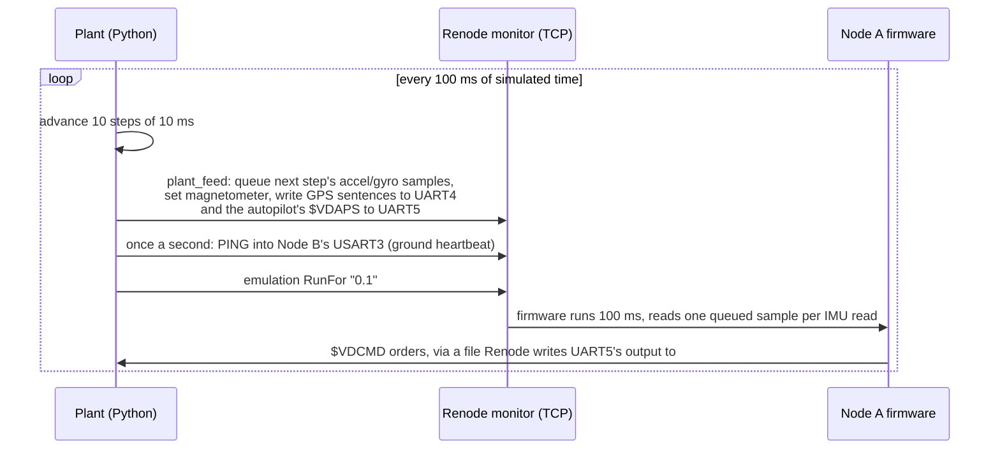

# Plant model and co-simulation

The plant model is the simulated world: the power line, the vehicle flying
along it, the wind, the sensors that observe it all, and the autopilot that
flies the vehicle on Node A's orders. It drives Node A's
sensors inside Renode in lockstep with the firmware, so the firmware runs on
data from a physically consistent flight instead of hand-set test values.

Code: [`sim/plant/`](../sim/plant) (model), [`sim/cosim.py`](../sim/cosim.py)
(Renode link), [`sim/mission.py`](../sim/mission.py) (mission runner),
[`renode/plant_feed.py`](../renode/plant_feed.py) (Renode side).

## The world

| Element | Model |
|---------|-------|
| Route | [`line_a`](../sim/plant/routes/line_a.json): six pylons over 1.5 km with two bends; local East-North-Up coordinates, origin at the first pylon (39.9 N, 32.8 E, 900 m above sea level) |
| Conductors | Three phases, 6 m apart, 25 m above ground, straight between pylons (no sag) |
| Line current | 400 A RMS per phase at 50 Hz, phases 120 degrees apart |
| Line field | Biot-Savart law for each straight conductor segment, summed over all phases and spans, at each instant of the 50 Hz cycle |
| Earth field | Uniform: 500 mG total, 56 degree dip, 5 degree east declination (typical for central Anatolia) |
| Wind | Mean (-2, 1) m/s plus first-order Gauss-Markov gusts, 1.5 m/s and 2 s on each horizontal axis |

Close to a loaded line the conductors' field is a sizeable part of the Earth's
field: about 0.02 G (4 %) at the 14 m cruise distance, and up to 0.17 G (35 %)
at 3.5 m. This is what corrupts a magnetometer near the line (HLR-008).

## The vehicle

A kinematic multirotor:

- It follows a desired point that moves along the route at the plan's speed
  (6 m/s, reached over 8 s from a hover), 20 m to the right of the line's
  centre at conductor height. That puts it 14 m from the nearest phase.
- A position/velocity controller tracks that point; horizontal acceleration is
  capped at 3 m/s^2 (about 17 degrees of tilt), and wind acts through drag.
- The thrust axis follows the demanded specific force with a 0.2 s lag, and the
  nose follows the route direction with a 1.5 s lag, so body rates stay realistic.
- The flight plan includes a close inspection pass near the second pylon,
  with the offset reduced to 10 m: about 4 m from a conductor, deliberately
  inside the 10 m minimum of HLR-001. Node A's safety logic has to keep the
  vehicle away; with a faulty autopilot that ignores it, the pass exercises the
  magnetometer's disturbance check.
- What the desired point does depends on the autopilot's mode (MISSION, HOLD,
  RTH, LAND) and on any keep-out distance from an avoidance order; see
  [autopilot-link.md](autopilot-link.md#the-simulated-autopilot). The autopilot
  also models the battery.

## The sensors

| Sensor | Rate | Model |
|--------|------|-------|
| Accelerometer | 100 Hz | Specific force in body axes, plus 0.004 g noise and a per-axis bias |
| Gyroscope | 100 Hz | Body rates, plus 0.05 deg/s noise and a per-axis bias |
| Magnetometer | 100 Hz in the model, 10 Hz into Renode (below) | Earth plus line field in body axes, plus 2 mG noise and a bias |
| GPS | 5 Hz | Position with a slowly wandering error (Gauss-Markov, 1 m horizontal, 2 m vertical, 20 s); NMEA GGA and RMC sentences at 9600 baud |

Body axes are x forward, y left, z up, for both the accelerometer/gyroscope and
the magnetometer. On a real LSM9DS1 the magnetometer axes need remapping.

## Co-simulation



`sim/cosim.py` starts Renode headless with its monitor on a TCP port and runs
the plant and the emulation in lockstep:

- **Accelerometer and gyroscope** samples are queued in Renode's LSM9DS1
  model, which hands out one sample per firmware read. A whole 100 ms step
  (ten samples) is queued with one monitor command, one step ahead, so the
  queue never runs dry and the firmware sees every 10 ms plant sample.
- **Magnetometer**: Renode's magnetometer model ignores queued samples, so its
  value is set once per step (10 Hz). The field changes over metres, which
  takes far longer than 100 ms at 6 m/s.
- **GPS** sentences for the step are written into UART4 just before it runs,
  and reach the firmware at the 9600 baud the firmware configured.
- The **autopilot's status** (`$VDAPS`, 5 Hz) goes into UART5 the same way.
  Node A's orders (`$VDCMD`) leave through UART5 into a file backend; the
  co-simulation reads what was added after each step, so an order acts on the
  plant one to two steps (100 to 200 ms) after Node A sent it.
- The **ground station's heartbeat**, a `PING` once a second, is written into
  Node B's command UART, until the scenario stops it.
- Values are clipped to the sensors' configured full-scale ranges, as a real
  sensor would clip.
- One step costs a fixed overhead of about 30 ms of monitor round trips plus
  the emulation itself, so a mission runs at about 0.35x real time. It is
  deterministic: the same seeds give the same flight.

### Renode model findings

The co-simulation exposed several differences between Renode's models and the
real parts, all handled on the simulation side so the firmware stays correct
for real hardware:

| Finding | Effect | Handling |
|---------|--------|----------|
| The LSM9DS1 model scales by ideal counts per unit, not the datasheet sensitivity | The firmware would read gyro +5 %, magnetometer +14.7 % | Fed values are divided by the gain (see [node_a_imu.robot](../tests/robot/node_a_imu.robot)) |
| The LSM9DS1 model aborts the whole emulation on out-of-range input | A plant bug crashed Renode during development | Inputs are clipped to the configured ranges |
| The magnetometer model ignores queued samples | Queued values were never read | Its value is set once per step |
| The stock STM32F4 UART models assume an 8 MHz clock | Every baud rate was halved: the 9600 baud GPS delivered 4800 baud | `renode/stm32f407.repl` sets the UARTs to the 16 MHz HSI, as already done for SysTick |

## Running a mission

```sh
python -m sim.mission --duration 90                       # writes build/mission/
python -m sim.mission --scenario link-loss --duration 25
python -m sim.mission --scenario battery --duration 40
python -m sim.mission --scenario no-avoidance --start 150 --duration 45
```

| Scenario | What happens |
|----------|--------------|
| `nominal` | The inspection pass; Node A keeps the vehicle at least 10 m from the line through the close part of the plan |
| `no-avoidance` | The same plan with an autopilot that ignores avoidance orders (fault injection) |
| `link-loss` | The ground station's heartbeat stops at 12 s; the vehicle returns home |
| `battery` | Starts at 22 % draining at 0.5 %/s: return home below 20 %, land below 10 % |

`--start` sets the along-track start position (the close pass begins at
210 m), to reach the interesting part sooner.

Output: `node_a.log` and `node_b.log` (the two consoles), `autopilot_rx.log`
(Node A's orders to the autopilot), `truth.csv` (the plant's ground truth every
50 ms, including mode, battery and keep-out) and `renode.log`.

With a ground station on the host (Linux/WSL, as root because Renode creates a
TAP device):

```sh
sudo python -m sim.mission --tap --duration 90 &
sudo ip addr add 192.168.10.1/24 dev tap0 && sudo ip link set tap0 up
python -m ground_station.display --record build/mission/flight.tlm
```

With `--tap` the simulated heartbeat is off: the display sends it over UDP.
Stop the display and the vehicle returns home 3 s later.

## Integration tests

`tests/integration` flies four scenarios and checks the firmware against
`truth.csv` (about 11 minutes in all):

- `test_mission.py`, nominal from 150 m: the close pass stays at least 10 m
  from the line (HLR-001), one proximity warning within a control cycle of the
  position and the avoidance order reaches the autopilot (HLR-002), the
  magnetometer heading matches the true heading, and GPS, CAN and telemetry
  run at their nominal rates without losses;
- `test_mission.py`, no-avoidance from 150 m: Node A still warns; the
  magnetometer is flagged only near the line and recovers afterwards, and the
  heading falls back to the GPS course meanwhile;
- `test_safety.py`, link-loss: RETURN_TO_HOME 3.0 to 3.3 s after the last
  heartbeat, and the vehicle turns back (HLR-003);
- `test_safety.py`, battery: RETURN_TO_HOME below 20 %, LAND below 10 %, and a
  1 m/s descent (HLR-004).
